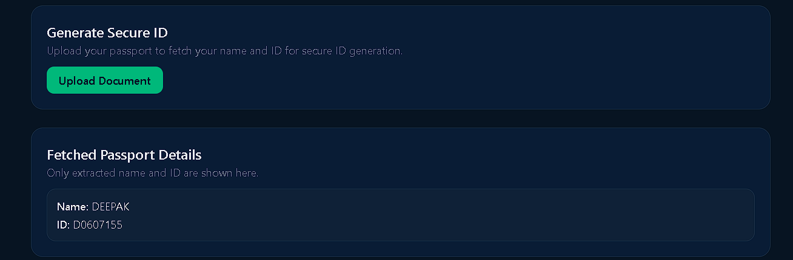
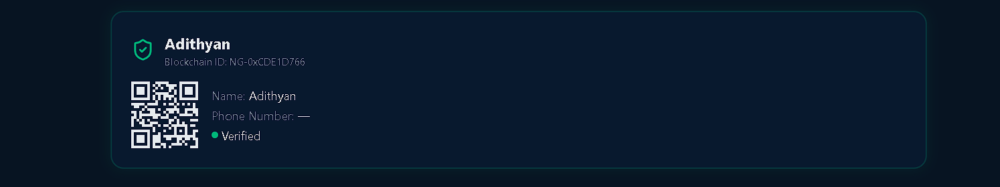
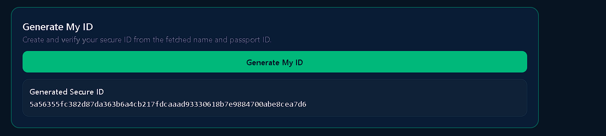
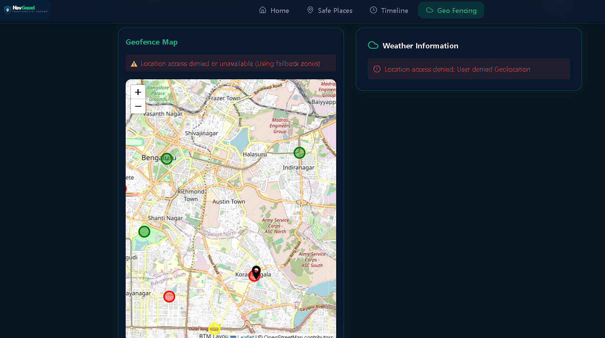

# NavGuard - Secure Traveler Safety App

<div align="center">
  
  
  <h1>NavGuard</h1>
  <h3><strong>Blockchain-inspired Secure Digital Identity + Real-time Safety for Travelers in High-Risk Terrains</strong></h3>

  <a href="https://github.com/adithyan-sys/NAV-GUARD/stargazers">
    
  </a>
  <a href="https://github.com/adithyan-sys/NAV-GUARD/issues">
    
  </a>
  <a href="https://github.com/adithyan-sys/NAV-GUARD">
    
  </a>
</div>

<br>

## 🚀 About NavGuard

**NavGuard** is a privacy-first traveler safety application designed for high-risk terrains like the **Himalayas and Western Ghats**. It provides a **tamper-proof Secure Digital Identity**, real-time geo-fencing with risk alerts, and a powerful one-tap Emergency SOS with live video proof.

**No more sharing raw Aadhaar or PAN cards.**  
Your identity is now protected using secure hashing.

---

## ✨ Key Features

- **Secure Digital ID**  
  Upload documents → Extract data using OCR → Generate unique SHA-256 Secure ID (Name + Document ID)

- **Smart Document Upload & OCR**  
  Supports Aadhaar, PAN Card, Passport. Extracts Name, ID Number, DOB, and Gender.

- **Real-time Geo-Fencing & Risk Alerts**  
  Color-coded risk zones (🟢 Safe | 🟡 Caution | 🔴 High Risk) using Google Maps API.

- **Emergency SOS with Video Proof**  
  One-tap SOS → Record live video → Send location + video to nearest police, hospital & rescue teams.

- **Privacy First**  
  Only hashed data is used. Fully aligned with DPDP Act.

---

## 🛠 Tech Stack

| Layer          | Technology                          |
|----------------|-------------------------------------|
| Frontend       | React.js + Vite + Tailwind CSS      |
| Backend        | Python + Flask                      |
| OCR            | OpenBharatOCR                       |
| Maps           | Google Maps API                     |
| Hashing        | CryptoJS (SHA-256)                  |
| Deployment     | Vercel (Frontend) + Render (Backend)|

---

## 📸 Project Screenshots

<div align="center">






</div>

---

## 🚀 How to Run Locally

### 1. Clone the Repository
```bash
git clone https://github.com/adithyan-sys/NAV-GUARD.git
cd NAV-GUARD

---
